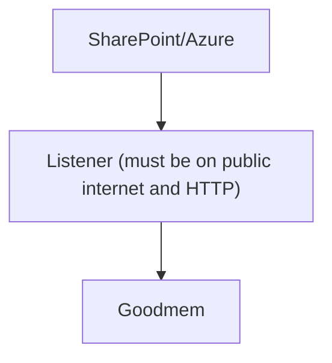

# SharePoint Connector for Goodmem

Sync files on a SharePoint site to a Goodmem memory space. Supports a one-time full sync and ongoing sync (reflecting any changes -- add, update, or delete to the SharePoint files -- to the Goodmem memory space) via Microsoft Graph webhooks.

**Files (repo layout):**

```
sharepoint/
├── sharepoint_client.py   # Fetches files from SharePoint (Graph API).
├── goodmem_client.py     # Goodmem API client: spaces, ingest, list/delete memories.
├── sync_once.py          # One-time full sync: copies all files from SharePoint to Goodmem.
├── sync_once.sh          # Run manual full sync (Setup steps 1–3); prerequisite: correct .env.
├── listener.py           # Graph webhook server: receives change notifications, syncs add/update/delete to Goodmem.
├── watch_listener.py     # Polls listener /activity; run locally to monitor sync.
├── deploy_fly_io.sh      # Deploy Goodmem and/or listener to Fly.io (recommended).
├── requirements.txt      # Python dependencies. Needed for many deployment platforms despite uv.
├── Dockerfile.listener   # Listener-only image (fly.listener.toml).
├── Dockerfile.both       # Listener image when using deploy_fly_io.sh --both.
├── fly.listener.toml     # Listener-only Fly config.
├── fly.both.toml         # Listener Fly config for deploy_fly_io.sh --both.
├── .env.example
└── .env                  # Your credentials (do not commit). deploy_fly_io.sh copies to .env.<cluster>.
```

---

## Setup

We have two options: manual sync or continuous sync (webhook).

### Prerequisite

1. **Ask IT** to grant the Azure AD app permissions. Share [permission.md](permission.md) with them.

2. **Copy and edit `.env`:**
   ```bash
   cp .env.example .env
   ```
   Fill in at least **Azure** vars (see each part below). For Part 1 (sync once), Goodmem and dependencies can be handled by `sync_once.sh` automatically. For Part 2 (continuous sync) you also set `SYNC_CLIENT_STATE`; `SYNC_NOTIFICATION_URL` is written by `deploy_fly_io.sh` after the listener exists.

---

### Part 1: Sync once (manual)

One-time full sync from SharePoint to Goodmem. Use this to backfill existing files or re-run whenever you want a fresh copy.

**Configure in `.env`:**
- `SHAREPOINT_CLIENT_ID`, `SHAREPOINT_TENANT_ID`, `SHAREPOINT_CLIENT_SECRET`, `SHAREPOINT_SITE_URL`
- `GOODMEM_BASE_URL`, `GOODMEM_API_KEY` — optional: if missing and Fly CLI is installed, `sync_once.sh` installs Goodmem (get.goodmem.ai/flyio) and writes these to `.env`.

**Run:**
```bash
./sync_once.sh
```
Or with a cluster-specific env: `./sync_once.sh --env-file .env.mycluster`

**What `sync_once.sh` does:** (1) Creates `.env` from `.env.example` if missing (then exits and asks you to fill at least SharePoint vars). (2) If `GOODMEM_BASE_URL` or `GOODMEM_API_KEY` is missing and the Fly CLI is installed, runs the Goodmem installer (Fly.io app name `sharepoint-sync-goodmem` by default; uses `FLY_ORG` / `FLY_REGION` from `.env` if set), writes `GOODMEM_BASE_URL` and `GOODMEM_API_KEY` to the env file, and scales the app to one machine. (3) Checks that all required vars (SharePoint + Goodmem) are set; exits with a clear message if any are missing. (4) Runs the sync: uses `uv run sync_once.py` if uv is available (deps installed on the fly), else `python sync_once.py` and, if that fails, runs `pip install -r requirements.txt` and retries once.

**Under the hood (sync_once.py):** (1) Authenticates with Microsoft Graph, (2) connects to the SharePoint site and fetches the drive, (3) lists all files recursively from the drive root, (4) looks up the Goodmem space by name (derived from the site URL, e.g. `SharePoint_Org_Site`) or creates it if missing, (5) lists existing memories in that space, (6) computes the delta (to add, to update, to remove), (7) deletes from Goodmem any memories for files no longer in SharePoint, (8) for each new or updated file: download and ingest into Goodmem (skipping unsupported MIME types and files already in sync by `modified_datetime`).

**Example output:**
```
Authenticating with Microsoft Graph API... ✓ Success.
Connecting to site... ✓ Connected.
Fetching files from SharePoint... ✓ Found 12 file(s).
Goodmem: Looking up space 'SharePoint_MyTenant_MySite'... Found. Using existing space.
Goodmem: Listing memories... Found 8.
Goodmem: Deleting memory for removed file: old_doc.pdf
Goodmem: Ingesting 4 file(s) (1.2 MB total)...
[====================>                    ] 512.0 KB / 1.2 MB
Sync complete.
```

---

### Part 2: Continuous sync (listener + webhooks)

The listener keeps SharePoint and Goodmem in sync whenever files change (add, update, delete). It must be reachable over **HTTPS** (e.g. on Fly.io). Run `deploy_fly_io.sh`; it deploys the listener and creates/renews the Graph subscription. The listener runs a startup full sync (same as sync_once) then receives webhooks.

**Configure in `.env`:**
- Same as Part 1, plus:
- `SYNC_CLIENT_STATE` — a secret string you choose (used to validate Graph notifications).
- Optionally `FLY_ORG`, `FLY_REGION`, `OPENAI_API_KEY` (see script help).  
- `SYNC_NOTIFICATION_URL` — leave unset; the deploy script writes it to `.env.<cluster>` after the listener app exists.

**Run:**
```bash
# Deploy both Goodmem and the listener (first time or full refresh)
./deploy_fly_io.sh --both --org YOUR_ORG

# Or only the listener (Goodmem already exists)
./deploy_fly_io.sh --listener-only --org YOUR_ORG

# Re-deploy the listener only using a specific .env file (app name derived from file: .env.incorta-sharepoint -> incorta-sharepoint-listener). Omit --org if FLY_ORG is in the env file.
./deploy_fly_io.sh --listener-only --env-file .env.incorta-sharepoint
```
Use `--org` / `--region` if not set in the env file; run `./deploy_fly_io.sh -h` for all options. The script uses a **cluster name** at the top (e.g. `sharepoint-joint`): Goodmem app = `<cluster>-goodmem`, Listener app = `<cluster>-listener`, env file = `.env.<cluster>`. If `.env.<cluster>` is missing it is created from `.env` and updated with `GOODMEM_BASE_URL`, `GOODMEM_API_KEY`, and `SYNC_NOTIFICATION_URL` after deploy.

**Under the hood:** (1) **Deploy Goodmem** (if `--both`): runs the [get.goodmem.ai/flyio](https://get.goodmem.ai/flyio) installer, scales to one machine, optionally creates an OpenAI embedder if `OPENAI_API_KEY` is set. (2) **Deploy listener**: creates the Fly app (or uses existing), imports secrets from `.env.<cluster>`, deploys with one machine (`--ha=false`). (3) **Create/renew subscription**: the script runs `listener.py create-subscription --env-file .env.<cluster>` so Microsoft Graph sends change notifications to your listener URL; renew periodically (e.g. every 2 days) or re-run the deploy script. (4) **Listener startup**: on boot it runs a full sync (same logic as sync_once), then handles POSTs to `/sync/webhook`; each notification is queued and processed (root sync or per-item add/update/delete).

**Renew subscription manually** (e.g. before expiry, or if it failed during deploy): `python listener.py create-subscription --env-file .env.sharepoint-joint` (use your `.env.<cluster>`). The script will PATCH the existing subscription instead of creating a duplicate.

**Restarting a suspended listener:** If Fly.io suspends the app when idle, start the machine (not `fly apps resume`):
```bash
fly machine start $(fly machine list -a sharepoint-joint-listener 2>/dev/null | awk '/^[0-9a-f]{14}/ {print $1; exit}') -a sharepoint-joint-listener
```

**Watch what happens:** Use `watch_listener.py` to monitor the listener’s activity (run locally; use the same env file as your cluster):
```bash
python watch_listener.py --env-file .env.sharepoint-joint -n 0.5
# Or pass the listener URL:
python watch_listener.py -n 0.5 https://sharepoint-joint-listener.fly.dev
```
You’ll see notifications received, the root sync plan (To Add / To Update / To Remove), then `[Syncing]` per file and `[Synced]` or `[Failed]` when each finishes. When idle, at most one “no new activity (listener reachable)” line is shown.

**Example watcher output:**
```
Watching listener activity at https://sharepoint-joint-listener.fly.dev/activity (interval: 0.5s)
Connected to listener. Waiting for activity...

  2026-02-02 01:19:33  [notification_received]  Received 1 change(s) from Graph
  2026-02-02 01:19:44  To Add
  2026-02-02 01:19:44    (none)
  2026-02-02 01:19:44  To Update
  2026-02-02 01:19:44    └── Goomem_just_works.docx
  2026-02-02 01:19:44  To Remove
  2026-02-02 01:19:44    (none)
  2026-02-02 01:19:45  [Syncing] Update: Goomem_just_works.docx
  2026-02-02 01:19:46  [Synced] Update: Goomem_just_works.docx
```

**Manual deployment (alternative):** Create the Fly app with `fly launch --no-deploy --name YOUR_LISTENER_APP --config fly.listener.toml`, set `SYNC_NOTIFICATION_URL=https://YOUR_LISTENER_APP.fly.dev/sync/webhook` in `.env`, run `fly secrets import < .env`, then `fly deploy`. The listener stays up for webhooks (`auto_stop_machines = 'off'`, `min_machines_running = 1`).

**References (Microsoft):** [subscription resource type](https://learn.microsoft.com/en-us/graph/api/resources/subscription) · [Change notifications (webhooks)](https://learn.microsoft.com/en-us/graph/change-notifications-overview)

---

## Technical details

### `sharepoint_client.py`

Fetches files from SharePoint. Do not load credentials from `.env` except under `__main__`.

Example file JSON:

```json
{
  "id": "01DSLNGZ2OAHMTF4SKE5BYGBMAYG6X6HMV",
  "name": "claude_usage.pdf",
  "web_url": "https://incorta.sharepoint.com/sites/Pair/Shared%20Documents/claude_usage.pdf",
  "download_url": "...",
  "size": 153749,
  "created_datetime": "2026-01-28T08:27:35Z",
  "modified_datetime": "2026-01-28T08:27:35Z",
  "created_by": "Mohamed Helmy",
  "modified_by": "Mohamed Helmy",
  "mime_type": "application/pdf",
  "file_hash": null
}
```

### `goodmem_client.py`

Goodmem API client. Do not load credentials from `.env` except under `__main__`.

- Create space, find space by name, list/delete memories, ingest files.
- `find_space_by_name(space_name)` returns the space ID or `None`; `sync_once.py` creates a new space when `None`.

### `sync_once.py`

Full sync from SharePoint to Goodmem: fetches all files from the default drive (root, recursive) and syncs them. Creates a space from the site URL if needed (`SharePoint_{Org}_{Site}`). Rules:

1. File not in Goodmem → ingest.
2. File in Goodmem with newer `modified_datetime` → delete old memory, ingest again.
3. File in Goodmem but no longer in SharePoint → delete memory.

**Space name:** Derived from `SHAREPOINT_SITE_URL`: org = host before `.sharepoint.com`, site = first segment after `sites/`; space name = `SharePoint_{Org}_{Site}`.

**Supported MIME types:** text/*, PDF, RTF, Word (.doc/.docx), types containing "+xml" or "json". Others are skipped.

### `listener.py`

Microsoft Graph webhook server. Run `listener.py server` (e.g. on Fly.io via Dockerfile.listener); run `listener.py create-subscription` to create or renew the subscription (if one already exists for the same resource and client state, it is renewed via PATCH instead of creating a duplicate). Requires same SharePoint/Goodmem env as `sync_once.py` plus `SYNC_NOTIFICATION_URL` and `SYNC_CLIENT_STATE`.

The server exposes **GET /activity** with an in-memory log of recent events. Use **`watch_listener.py`** locally to poll and print this log; pass **`--env-file .env.<cluster>`** to use that env's `SYNC_NOTIFICATION_URL`, or pass the listener base URL as an argument.

## Known limitations

- It takes about 30 seconds for the update to reach our listener from Azure. 
- Current implementation requires the listener to do delta every time a push is received. 


