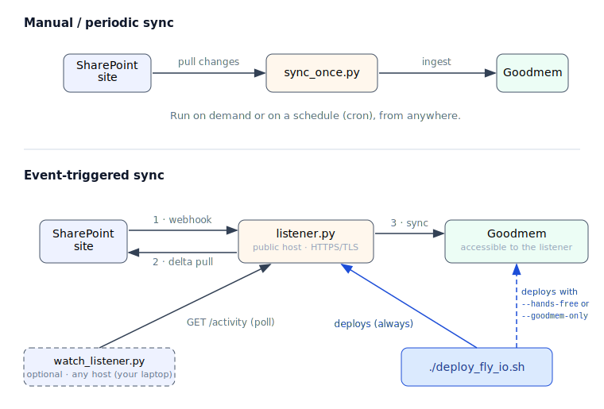

# SharePoint Connector for Goodmem

Keep a Goodmem space in sync with a SharePoint site. This connector (an Azure AD app) offers two ways to sync — **manual/periodic** and **event-triggered** — shown below.

## How it works



The connector is a single Go binary, **`connector`**, with subcommands (`sync-once`, `serve`, `create-subscription`, `watch`). Build it with `go build -o connector ./cmd/connector`.

**Manual / periodic sync** — `connector sync-once` runs between SharePoint and Goodmem: it pulls the current files and ingests them into the Goodmem space. Run it on demand or on a schedule (cron), from anywhere.

**Event-triggered sync** — a long-running **listener** (`connector serve`) sits between SharePoint and Goodmem. Microsoft Graph sends it a webhook on each change; the listener pulls the delta and syncs it to Goodmem. Graph requires the listener to be **publicly reachable over HTTPS/TLS** — any host works. It exposes `/metrics` (Prometheus) and `/syncs` (a durable SQLite sync history) for monitoring; `connector watch <url>` is an optional local tool that tails the listener's `/activity` log (the listener syncs with or without it). `./deploy_fly_io.sh` is the supported way to stand this up on Fly.io: with no flag it deploys the listener (Goodmem already runs elsewhere); `--hands-free` deploys the listener and a Goodmem server together. Run `./deploy_fly_io.sh --help` to see all modes and options. (Railway support is coming.)

> **Scope:** the listener syncs and subscribes to the site's **first** document library, and **always syncs the whole drive** — `SHAREPOINT_FOLDER_PATH` scopes only a one-time `sync-once`, not the listener. See [usage.md → Scope & limits](docs/usage.md#scope--limits).

## Getting started

1. **Ask IT** to grant the Azure AD app permissions. Share [permission.md](docs/permission.md) with them.

2. **Set credentials in `.env`.** Create it from the template:
   ```bash
   cp .env.example .env
   ```
   Then fill in the variables for the mode you intend to run. 
   [`.env.example`](.env.example) is very self-documenting, and [usage.md](docs/usage.md) explains which variables are needed for each mode. In general, there are four groups of variables:  
   * **Azure AD & SharePoint** — always required (ask your IT for the values).
   * **Goodmem** — required for manual sync and the listener when Goodmem already exists. If you let `./deploy_fly_io.sh --hands-free` provision Goodmem for you, these get filled in automatically.
   * **Graph webhook** — event-triggered sync only. The deploy script generates `GRAPH_CLIENT_STATE` and writes `GRAPH_NOTIFICATION_URL` for you; set them by hand only for a manual (non-Fly) deployment.
   * **Fly.io** — event-triggered sync deployed via `deploy_fly_io.sh`; skip for a manual sync.
3. **Sync**. You have two options:  
   * **Manual / periodic sync** — run `./connector sync-once` on demand or on a schedule (cron). See [usage.md](docs/usage.md#manual--periodic-sync).  
   * **Event-triggered sync** — deploy the listener with `./deploy_fly_io.sh` (see [usage.md](docs/usage.md#event-triggered-auto-sync-the-listener)). Optionally tail it locally with `./connector watch https://<listener>`.


## Documentation

* **[usage.md](docs/usage.md)** — build/run the `connector` binary, deploy the listener to Fly.io, and monitor via `/metrics` and `/syncs`.
* **[tech_details.md](docs/tech_details.md)** — internals: the clients, the sync engine, and how the file diff is computed and applied.

## Repo layout

```
sharepoint/
├── cmd/connector/        # The `connector` binary (subcommands: sync-once, serve, create-subscription, watch).
├── internal/
│   ├── graph/            # Microsoft Graph client: auth, drive listing, delta, subscriptions, retry/backoff.
│   ├── gm/               # Goodmem SDK wrapper.
│   ├── syncer/           # Sync engine: diff, apply, pending-retry, processing-status polling.
│   ├── server/           # Webhook listener + HTTP endpoints (/sync/webhook, /healthz, /metrics, /syncs, /activity) + metrics.
│   ├── store/            # SQLite durable sync history (behind /syncs).
│   ├── config/           # .env / environment loading.
│   ├── memid/            # Deterministic memory IDs.
│   └── fakes/            # In-process fake Graph/Goodmem servers for integration tests.
├── deploy_fly_io.sh      # Deploy the listener (and optionally Goodmem) to Fly.io.
├── Dockerfile            # Builds `connector` into a distroless static image.
├── fly_io.toml.template  # Fly config template (app/region substituted by the deploy script; mounts the /data volume).
├── .env.example          # Documents every config variable.
└── docs/                 # usage.md, tech_details.md, permission.md, PRODUCTIONIZATION.md, architecture diagram.
```

> **Note:** the Python files (`sharepoint_client.py`, `goodmem_client.py`, `sync_once.py`, `listener.py`, `watch_listener.py`) are the original proof-of-concept, retained only as a test oracle during the Go migration and removed at cutover. Use the `connector` binary, not the Python scripts.

## Roadmap

* Use TOML-based environment file than .env.
* Railway deployment support.