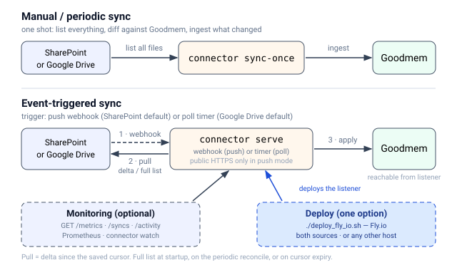

# Goodmem Connectors

Keep a Goodmem space in sync with your content. One binary syncs from
**SharePoint** or **Google Drive**, either **manually/periodically** or
**event-triggered**.

## How it works



The connector is a single Go binary, **`connector`**, with subcommands
(`sync-once`, `serve`, `create-subscription`, `watch`). Build it with
`go build -o connector ./cmd/connector`.

**Manual / periodic sync** — `connector sync-once` pulls the source's current
files and ingests them into the Goodmem space. Run it on demand or on a schedule
(cron), from anywhere.

**Event-triggered sync** — a long-running **listener** (`connector serve`) keeps
Goodmem up to date as files change. It gets changes either by **push** (the
provider POSTs a webhook — the SharePoint default, needs a public HTTPS URL) or by
**poll** (the listener pulls the delta on a timer — the Google Drive default,
needs nothing public). It exposes `/metrics` (Prometheus) and `/syncs` (durable
sync history) for monitoring.

Run it on **any host** — it's a single static binary. Two deploy scripts automate
the common ones: **`./deploy_fly_io.sh`** (Fly.io) and **`./deploy_gcp.sh`** (a GCE
VM — the only *keyless* option for Google Drive, since the VM runs as an attached
service account). Both work for either source and can install a Goodmem server
alongside the listener. See
[usage.md → Where to run the listener](docs/usage.md#where-to-run-the-listener).
(Railway support is coming.)

## Getting started

**1. Ask IT for credentials.** Hand them the request doc for your source:

| Source | Give IT | They return |
|---|---|---|
| SharePoint | [permissions-sharepoint.md](docs/permissions-sharepoint.md) | client id, client secret, tenant id |
| Google Drive | [permissions-google-drive.md](docs/permissions-google-drive.md) | service-account email + one of three credentials, Drive ID |

**2. Create `.env`:** `cp .env.example .env`, then fill in your source's group plus
**Goodmem** (and **Fly.io** if you'll deploy the listener).
[`.env.example`](.env.example) documents every variable;
[usage.md](docs/usage.md) explains which ones each mode needs.

<details>
<summary><b>SharePoint quickstart</b></summary>

```dotenv
SOURCE=sharepoint
AZURE_AD_CLIENT_ID=...
AZURE_AD_TENANT_ID=...
AZURE_AD_CLIENT_SECRET=...
SHAREPOINT_SITE_URL=https://your-tenant.sharepoint.com/sites/YourSite
GOODMEM_BASE_URL=https://your-goodmem
GOODMEM_API_KEY=...
```

```bash
./connector sync-once --dry-run   # verify credentials, see the plan
./connector sync-once             # sync
./deploy_fly_io.sh                # or deploy the listener
```
</details>

<details>
<summary><b>Google Drive quickstart</b></summary>

Share the Shared Drive with the service-account email as **Viewer** (Google Cloud
roles don't grant Drive access), then:

```dotenv
SOURCE=google-drive
GOOGLE_DRIVE_ID=<DRIVE_ID>
GOOGLE_DRIVE_SA_JSON_FILE=/secure/path/goodmem-connector.json   # or a keyless path
GOODMEM_BASE_URL=https://your-goodmem
GOODMEM_API_KEY=...
```

```bash
./connector sync-once --source google-drive --dry-run
./connector sync-once --source google-drive
./connector serve --source google-drive    # listener (poll mode by default)
```

Three deploy-and-forget auth paths (key / GCP-attached service account / workload
identity federation) — see [usage.md](docs/usage.md#google-drive-service-account).
</details>

> ⚠️ **One Goodmem space per source** — never share a `GOODMEM_SPACE_ID` between a
> SharePoint and a Google Drive listener; leave it unset and each creates its own.

## Documentation

* **[usage.md](docs/usage.md)** — the manual: authentication for both sources,
  running and deploying, push vs poll, endpoints, monitoring, scope & limits, ops.
* **[tech_details.md](docs/tech_details.md)** — internals: the `Source` interface,
  the sync engine, how the diff is computed and applied, safety guards.
* **[permissions-sharepoint.md](docs/permissions-sharepoint.md)** ·
  **[permissions-google-drive.md](docs/permissions-google-drive.md)** — hand to IT.
* **[MULTI_SOURCE.md](docs/MULTI_SOURCE.md)** — multi-source design decisions.
* **[PRODUCTIONIZATION.md](PRODUCTIONIZATION.md)** — the production roadmap.

## Repo layout

A shared **core** engine plus one folder per **provider** — the engine depends only
on the `source.Source` interface, never on a provider.

```
goodmem-connectors/
├── cmd/connector/            # The `connector` binary (sync-once, serve, create-subscription, watch).
├── internal/
│   ├── core/                 # Provider-agnostic engine (shared by every source):
│   │   ├── source/           #   The Source interface + neutral types (the contract).
│   │   ├── syncer/           #   Sync engine: diff, apply, pending-retry, dead-letter, processing-status polling.
│   │   ├── server/           #   Listener: webhook + poll loops, HTTP endpoints (/sync/webhook, /healthz, /readyz, /metrics, /syncs, /activity), metrics.
│   │   ├── store/            #   SQLite durable sync history (behind /syncs).
│   │   ├── gm/               #   Goodmem SDK wrapper (the destination).
│   │   ├── config/           #   .env / environment loading.
│   │   ├── memid/            #   Deterministic memory IDs.
│   │   └── fakes/            #   In-process fake source/Goodmem servers for integration tests.
│   └── providers/
│       ├── sharepoint/       # Microsoft Graph client: auth, drive listing, delta, subscriptions, retry/backoff.
│       └── googledrive/      # Google Drive v3 SDK client: listing, Changes API, export/download, push channels.
├── deploy/alerts.yml         # Recommended Prometheus/Alertmanager rules.
├── deploy_fly_io.sh          # Deploy the listener (and optionally Goodmem) to Fly.io.
├── deploy_gcp.sh             # Deploy to a GCE VM — the keyless path for Google Drive (attached service account).
├── Dockerfile                # Builds `connector` into a distroless static image.
├── fly_io.toml.template      # Fly config template (mounts the /data volume for durable state).
├── .env.example              # Documents every config variable.
└── docs/                     # usage.md, tech_details.md, permissions-*.md, MULTI_SOURCE.md, architecture diagram.
```

> **Note:** the Python files (`sharepoint_client.py`, `goodmem_client.py`,
> `sync_once.py`, `listener.py`, `watch_listener.py`) are the original
> proof-of-concept, kept **only as a historical reference**. They are **never
> deployed** and are **not a production fallback** — the Go `connector` binary is
> the sole production system. Use the binary, not the Python scripts.

## Roadmap

* Use a TOML-based config file instead of `.env`.
* Railway deployment support.
